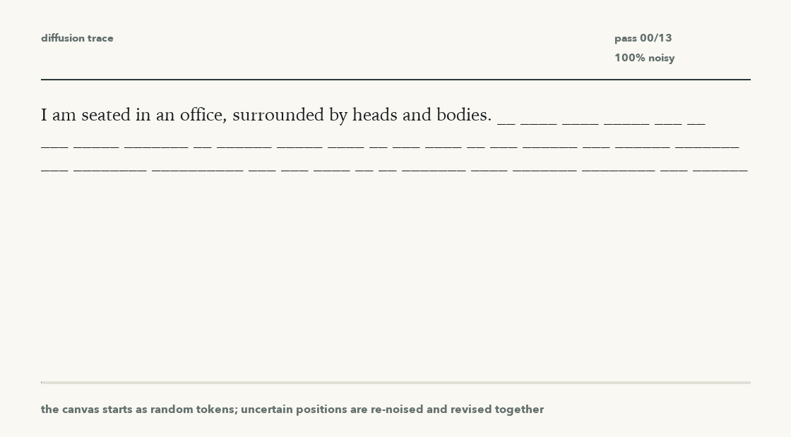

# Text Diffusion Lab

A small, corpus-agnostic text diffusion project inspired by Google DeepMind's Gemini Diffusion demo. Instead of generating one token at a time, this model learns to reconstruct masked byte sequences and samples by iteratively refining noisy text in parallel.

This is an educational implementation, not a reproduction of Google's model.

## What It Builds

- Byte-level baseline, so any UTF-8 text file can be used directly.
- Local byte-BPE token diffusion path for stronger text samples without external pretrained weights.
- MLX/Metal bidirectional Transformer denoiser with timestep conditioning.
- MDLM/SUBS-style masked discrete diffusion objective for the token path.
- Iterative refinement and ancestral carry-forward samplers.
- EMA checkpointing for smoother sampling weights.
- Corpus ingest script for local files or authorized URLs, including PDFs.

## Setup

```bash
python3 -m venv .venv
.venv/bin/python -m pip install --upgrade pip
.venv/bin/python -m pip install -r requirements.txt
```

## Quick Smoke Run

```bash
make demo-corpus
make train CORPUS=data/demo.txt STEPS=50 D_MODEL=96 LAYERS=2 HEADS=4 SEQ_LEN=128 BATCH_SIZE=16
make sample PROMPT="The system began"
```

## Use Your Own Corpus

For a local text file:

```bash
make train CORPUS=/path/to/book.txt
```

For an authorized URL:

```bash
make fetch URL="https://example.com/source.pdf" CORPUS=data/corpus.txt
make train CORPUS=data/corpus.txt
```

For the PDF URL currently being used locally:

```bash
make fetch URL="https://raisuman123.wordpress.com/wp-content/uploads/2013/05/david-foster-wallace-infinite-jest-v2-0.pdf" CORPUS=data/infinite_jest.txt RAW_OUT=data/raw/infinite_jest
make train CORPUS=data/infinite_jest.txt OUT=outputs/infinite-jest
make sample OUT=outputs/infinite-jest PROMPT="It was a"
```

`data/` and `outputs/` are ignored by git so raw source material and checkpoints stay local.

## Useful Commands

```bash
make train
make sample PROMPT="A beginning"
make smoke
```

The default `train` and `sample` targets use MLX. Optional Torch reference scripts are still present as `make train-torch` and `make sample-torch`, but they are not the normal path on Apple Silicon.

## From-Scratch Pretraining

Every MLX training run starts from randomly initialized weights. There is no pretrained model, no pretrained tokenizer, and no outside text unless you put it in the corpus file.

For the extracted corpus currently at `data/infinite_jest.txt`:

```bash
make pretrain
make pretrain-sample PROMPT="It was a" NEW_BYTES=300 SAMPLE_STEPS=64 TEMPERATURE=0.8 TOP_K=50
```

Default pretraining settings are intentionally modest:

```text
steps=10000 batch=32 seq_len=256 layers=4 heads=4 d_model=192
```

For a larger scratch run:

```bash
make pretrain PRETRAIN_OUT=outputs/infinite-jest-scratch-large PRETRAIN_STEPS=30000 PRETRAIN_SEQ_LEN=512 PRETRAIN_LAYERS=6 PRETRAIN_HEADS=8 PRETRAIN_D_MODEL=256 PRETRAIN_BATCH_SIZE=16 PRETRAIN_LR=2e-4
```

## Token Diffusion

The original path predicts raw bytes. The token path keeps the same discrete diffusion idea, but trains a local byte-BPE tokenizer first and denoises token IDs. The default token setup is a full-sequence diffusion language model: every position may be masked during training, the model learns to reconstruct masked tokens anywhere in the block, and prompts or infill spans are clamped only at inference time. The default objective is `mdlm-subs`, with no output class for `<MASK>`, no causal attention mask, and no next-token prediction loss.

Current uniform-token diffusion trace:



```bash
make train-token TOKEN_CORPUS=data/infinite_jest.txt TOKEN_OUT=outputs/infinite-jest-token-diffusion
make posttrain-token POSTTRAIN_INIT=outputs/infinite-jest-token-diffusion POSTTRAIN_OUT=outputs/infinite-jest-token-diffusion-posttrain
make sample-token TOKEN_OUT=outputs/infinite-jest-token-diffusion PROMPT="It was a" NEW_TOKENS=120 SAMPLE_STEPS=10 TEMPERATURE=0.8 FINAL_TEMPERATURE=0.35 TOP_K=40 REMASK_STRATEGY=hybrid TOKEN_WEIGHTS=auto
make hf-diffusion-gif HF_MASKED_MODEL=outputs/roberta-large-infinite-jest-mdlm-subs-selfcond-step500-preserved PROMPT="I am seated in an office, surrounded by heads and bodies." HF_GIF_OUT=assets/token-diffusion-mdlm-subs-selfcond-step500.gif HF_GIF_SEED=10074 HF_GIF_MIN_QUALITY_SCORE=20 HF_GIF_MIN_GENERATED_WORDS=30 HF_INITIAL_NOISE=uniform HF_RENOISE=uniform HF_SAMPLER=refine HF_UNMASK_SCHEDULE=cosine HF_REMASK_STRATEGY=entropy SAMPLE_STEPS=48 NEW_TOKENS=48 TEMPERATURE=0.8 FINAL_TEMPERATURE=0.4 TOP_K=64 HF_ENTROPY_BOUND=0.1 HF_EARLY_STOP_ENTROPY=0.005 HF_PIECE_LOGIT_PENALTY=1.2 HF_REPEAT_PENALTY=3.5 HF_SELF_CONDITIONING_STRENGTH=0.5
```

Useful defaults:

```text
vocab=2048 steps=20000 batch=32 seq_len=256 prefix_len=0 diffusion_steps=10 layers=6 heads=8 d_model=256
```

Stronger scratch run:

```bash
make train-token-strong
make continue-token-strong
make sample-token TOKEN_OUT=outputs/infinite-jest-token-diffusion-4096-512 PROMPT="It was a" NEW_TOKENS=120 SAMPLE_STEPS=16 TEMPERATURE=0.8 FINAL_TEMPERATURE=0.35 TOP_K=40 REMASK_STRATEGY=hybrid TOKEN_WEIGHTS=auto
```

The strong target trains a 4096-token byte-BPE vocabulary, 512-token context, 16 diffusion steps, and an 8-layer 384-width denoiser. `continue-token-strong` continues that checkpoint into `outputs/infinite-jest-token-diffusion-4096-512-continue10k` with a lower learning rate. Both targets use masked denoising only: no causal attention mask and no next-token prediction objective. Set `TOKEN_STRONG_PREFIX_LEN=32` only when you intentionally want prefix-conditioned continuation training rather than full-sequence diffusion-LM training.

LLaDA-lite scratch diagnostic:

```bash
make train-token-llada-lite
make sample-token TOKEN_OUT=outputs/infinite-jest-token-diffusion-llada-lite PROMPT="I am seated in an office," NEW_TOKENS=160 SAMPLE_STEPS=96 TOP_K=80 TOKEN_WEIGHTS=auto
```

This target keeps the model small enough for the Mac mini but moves closer to modern masked diffusion language modeling: full-sequence `prefix_len=0`, exact-k mask sampling, low-discrepancy mask-rate sampling, 64 diffusion timesteps, and low-confidence carry-forward sampling. It is still a tiny corpus/model compared with lab systems, so samples are treated as diagnostics until they pass the content validator.

Sampler knobs:

```text
TOKEN_WEIGHTS=auto       prefers weights_ema.safetensors when present
TOKEN_SAMPLER=ancestral  reveals high-confidence masked tokens and carries them forward
UNMASK_SCHEDULE=linear   can be changed to cosine
REMASK_STRATEGY=hybrid   combines low confidence and high entropy
FINAL_TEMPERATURE=0.35   anneals temperature down over denoising steps
BLANK_COMMIT_PENALTY=6.0 delays whitespace-only tokens until later denoising passes
```

Diagnostics:

```bash
make overfit-token-mdlm TOKEN_OVERFIT_STEPS=300
make sample-token TOKEN_OUT=outputs/diagnostics/token-overfit-mdlm PROMPT="The system" NEW_TOKENS=32 SAMPLE_STEPS=16 TOKEN_SAMPLER=ancestral TOKEN_WEIGHTS=raw
make infill-token TOKEN_OUT=outputs/diagnostics/token-overfit-mdlm INFILL_TEMPLATE="The system [MASK:16] in parallel." SAMPLE_STEPS=16 TOKEN_WEIGHTS=raw
```

The overfit target trains a small model on one repeated window. It is meant to catch objective/sampler bugs before spending time on a larger Infinite Jest run.

Post-training for this repo means continued denoising training or sampler/objective tuning, not instruction tuning. It can help, especially if it teaches the model the same mask schedule used at inference, but the largest gains are likely to come from confidence-based unmasking, a better mask schedule, more training tokens, and a larger model. Starting from a pretrained masked LM would probably improve quality much faster, but that would no longer be a fully from-scratch run.

Fallback masked-LM diffusion sampler:

```bash
.venv/bin/python -m pip install -r requirements-hf.txt
make sample-hf-masked-diffusion HF_MASKED_MODEL=roberta-base PROMPT="I am seated in an office," NEW_TOKENS=96 SAMPLE_STEPS=96 TOP_K=80
```

This does not use next-token prediction. It treats a Hugging Face masked language model as an absorbing-mask diffusion denoiser: the prompt is clamped, the continuation span starts as `[MASK]`, and high-confidence masked positions are committed over many denoising steps. Raw `roberta-base` is only a control; for the Nathan-style setup, diffusion-fine-tune it first:

```bash
make train-hf-masked-diffusion HF_MASKED_MODEL=roberta-base HF_DIFFUSION_OUT=outputs/roberta-infinite-jest-diffusion
make sample-hf-masked-diffusion HF_MASKED_MODEL=outputs/roberta-infinite-jest-diffusion PROMPT="I am seated in an office," NEW_TOKENS=96 SAMPLE_STEPS=96 TOP_K=80
```

For continuation generation, use the continuation-biased training target and the refine sampler. This keeps the objective diffusion-only, but trains on the actual task shape: a fixed prefix and a high/noisy masked continuation. The refine sampler predicts the whole continuation, re-masks uncertain or over-repeated pieces, and revises them over later denoising passes.

```bash
make train-hf-continuation-diffusion \
  HF_MASKED_MODEL=outputs/roberta-infinite-jest-diffusion-5k \
  HF_DIFFUSION_OUT=outputs/roberta-infinite-jest-continuation-diffusion

make sample-hf-masked-diffusion \
  HF_MASKED_MODEL=outputs/roberta-infinite-jest-continuation-diffusion \
  PROMPT="I am seated in an office, surrounded by heads and bodies." \
  NEW_TOKENS=96 SAMPLE_STEPS=96 TOP_K=40 \
  HF_SAMPLER=refine HF_UNMASK_SCHEDULE=cosine HF_REMASK_STRATEGY=entropy \
  HF_REPEAT_PENALTY=2.5 HF_ENTROPY_BOUND=0.1
```

The stronger HF path now defaults to a diffusion-specific setup: `HF_OBJECTIVE=mdlm-subs`, `HF_LOSS_WEIGHTING=mdlm`, mixed mask/uniform-token corruption, uniform canvas initialization, uniform re-noising, and self-conditioning. To compare sampler choices on the same prompts and seeds:

```bash
make hf-diffusion-ablations \
  HF_MASKED_MODEL=outputs/roberta-large-infinite-jest-uniform-mixed-1k \
  PROMPT="I am seated in an office, surrounded by heads and bodies." \
  NEW_TOKENS=64 SAMPLE_STEPS=64
```

This writes a JSON report with quality, diversity, repetition, and length metrics for mask-refine, uniform-refine, and uniform+self-conditioning runs.

Use this only as a fallback or baseline if the scratch Infinite Jest model remains too data-starved. Useful masked-LM candidates are `roberta-base` for a Nathan-style baseline, `FacebookAI/roberta-large` as a stronger masked-LM base, and `kuleshov-group/mdlm-owt` for a masked diffusion checkpoint if the full repo/tokenizer is available. Actual pretrained diffusion LMs such as DiffusionGemma, LLaDA, or MDLM checkpoints need their own loader and enough memory for their model size.

DiffusionGemma-style ideas to track in this repo:

- Prefer block/canvas denoising over single-token committing.
- Re-noise uncertain positions instead of carrying every early decision forward.
- Use entropy-bounded retention and adaptive stopping as sampler knobs.
- Treat RoBERTa as a control; broad diffusion-pretrained bases should be the main path if hardware allows.

## Notes

Gemini Diffusion is described by Google DeepMind as an experimental text diffusion model that refines noise step by step, generates blocks of tokens at once, and can iteratively correct errors during generation:

https://deepmind.google/models/gemini-diffusion/
