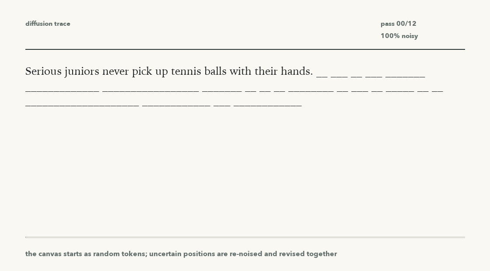

# Masked Diffusion LM Lab

This repo contains the current masked diffusion language model experiment over `data/infinite_jest.txt`.

The active model path is a RoBERTa-style masked denoiser adapted into a small text diffusion model. It is diffusion-only: no causal attention mask and no next-token prediction objective.

Current checkpoint:

```text
outputs/roberta-large-infinite-jest-mdlm-subs-selfcond-step500-preserved
```

Current write-up:

[docs/current-dlm-writeup.md](docs/current-dlm-writeup.md)

Current GIFs:




## Setup

```bash
python3 -m venv .venv
.venv/bin/python -m pip install --upgrade pip
.venv/bin/python -m pip install -r requirements.txt
```

## Corpus

The corpus and checkpoints are local and ignored by git.

```bash
make fetch
```

This downloads or extracts the authorized source into:

```text
data/infinite_jest.txt
```

## Train

The current training target continues from the previous Infinite Jest diffusion checkpoint and writes a new HF masked-diffusion checkpoint.

```bash
make train
```

Default training configuration:

```text
objective: mdlm-subs
corruption: mixed
uniform corruption fraction: 0.75
mask distribution: high
full mask fraction: 0.35
loss weighting: mdlm
self-conditioning probability: 0.25
self-conditioning strength: 0.5
```

## Sample

```bash
make sample
```

Override the prompt if needed:

```bash
make sample PROMPT="Serious juniors never pick up tennis balls with their hands."
```

The sampler uses uniform canvas initialization, uniform re-noising, entropy-based retention, cosine unmasking, and self-conditioning.

## GIF

```bash
make gif
```

The default output is:

```text
assets/token-diffusion-mdlm-subs-selfcond-step500.gif
```

## Ablations

```bash
make ablations
```

The ablation script compares:

```text
mask-refine
uniform-refine
uniform-selfcond
```

The latest report is:

```text
outputs/evals/hf-diffusion-ablations-mdlm-subs-step500.json
```
